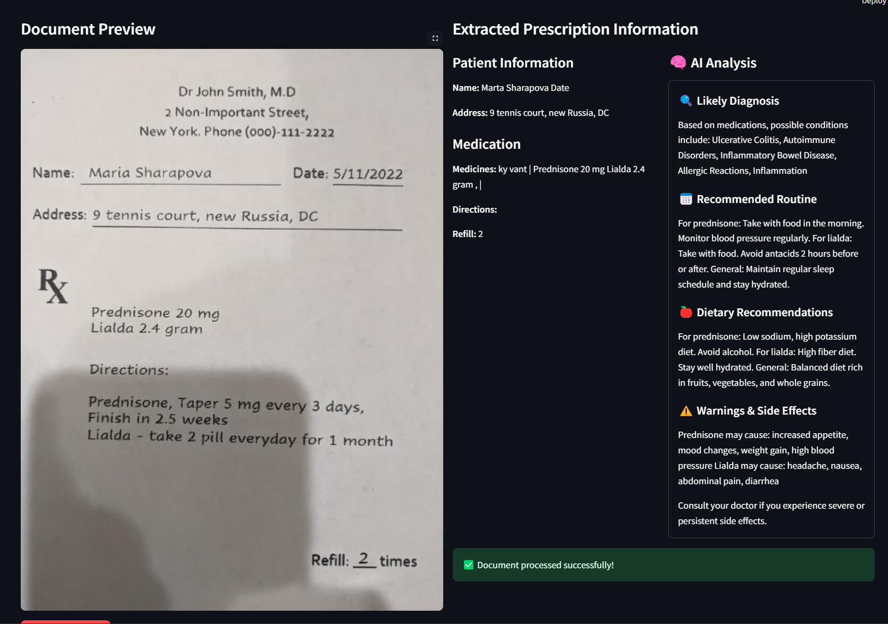
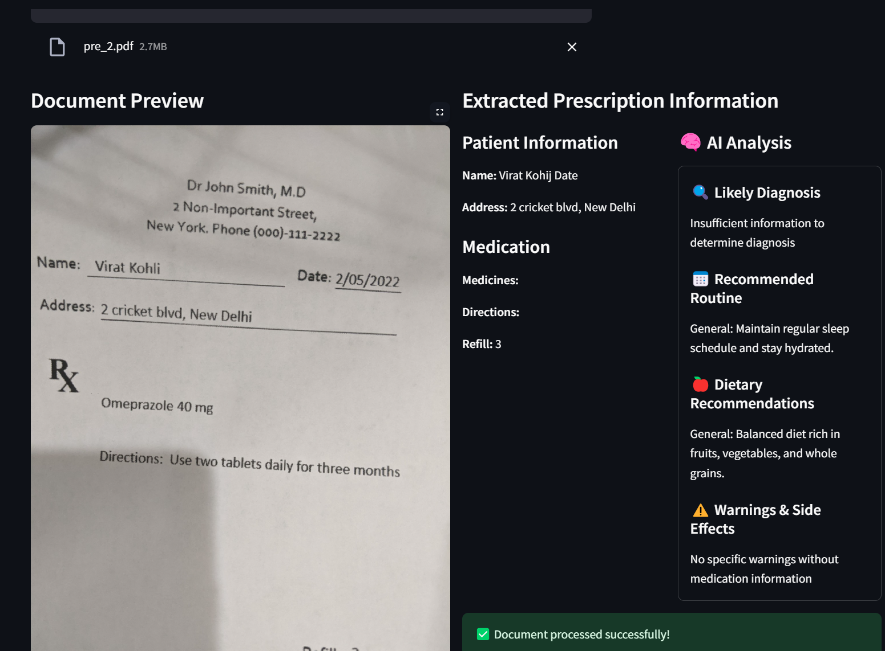

# RxTract - Medical Data Extractor

[](https://www.python.org/)
[](https://fastapi.tiangolo.com/)
[](https://streamlit.io/)
[](https://github.com/tesseract-ocr/tesseract)

An intelligent OCR-powered system for extracting structured data from medical documents (prescriptions and patient records) with AI-enhanced analysis.

## 🚀 Demo


_Interactive web interface for document processing_


_Structured output with AI-powered medical insights_

## ✨ Features

- **📄 Document Support**: PDF, PNG, JPG medical documents
- **🧠 AI Analysis**: Medical insights, drug interactions, dietary recommendations
- **⚡ Real-time Processing**: Fast OCR with Tesseract 5.5.0
- **🌐 Web Interface**: Easy-to-use Streamlit frontend
- **🔧 REST API**: FastAPI backend for integration
- **🛡️ Error Handling**: Robust processing with fallback mechanisms

## 🔧 Quick Setup

### Prerequisites

- Python 3.8+
- Tesseract OCR 5.5.0

### Installation

```bash
# Clone repository
git clone https://github.com/priyajitbiswal/RxTract.git
cd RxTract

# Setup environment
python -m venv venv
venv\Scripts\activate  # Windows
# source venv/bin/activate  # Linux/Mac

# Install dependencies
pip install -r requirements.txt

# Install Tesseract OCR
Scripts\install_tesseract.bat  # Windows
# sudo apt-get install tesseract-ocr  # Linux
# brew install tesseract  # macOS
```

### Running the Application

```bash
# Start backend (Terminal 1)
Scripts\run_backend.bat

# Start frontend (Terminal 2)
Scripts\run_frontend.bat

# Access application at http://localhost:8501
```

## 🛠️ Technology Stack

- **Backend**: FastAPI, Python 3.8+, Uvicorn
- **OCR**: Tesseract 5.5.0, OpenCV, pytesseract
- **AI**: SmolDocling integration for medical analysis
- **Frontend**: Streamlit for web interface
- **Processing**: pdf2image, PIL, PyPDF2

## 📚 API Usage

### Extract Medical Data

```python
import requests

with open('prescription.pdf', 'rb') as file:
    response = requests.post(
        'http://localhost:8000/extract_from_doc',
        files={'file': file},
        data={'file_format': 'prescription'}  # or 'patient_details'
    )

data = response.json()
print(data)
```

### Response Format

```json
{
  "patient_name": "John Doe",
  "medicines": "Amoxicillin 500mg",
  "directions": "Take 3 times daily with food",
  "ai_analysis": {
    "likely_diagnosis": ["Bacterial infection"],
    "dietary_recommendations": ["Increase probiotics"],
    "warnings": ["Monitor for allergic reactions"]
  }
}
```

## 📁 Project Structure

```
RxTract/
├── backend/src/           # FastAPI backend
│   ├── main.py           # API endpoints
│   ├── extractor.py      # OCR processing
│   └── parser_*.py       # Document parsers
├── frontend/app.py       # Streamlit interface
├── Notebooks/            # Development notebooks
├── Scripts/              # Windows batch scripts
│   ├── setup.bat         # Complete setup
│   ├── run_backend.bat   # Start backend
│   └── run_frontend.bat  # Start frontend
├── requirements.txt      # Dependencies
└── 4.png, 5.png         # Demo images
```

## 🔧 Troubleshooting

**Tesseract not found:**

```bash
# Check installation
tesseract --version

# Set path (Windows)
set TESSERACT_PATH=C:\Program Files\Tesseract-OCR\tesseract.exe
```

**Module errors:**

```bash
# Ensure virtual environment is active
venv\Scripts\activate
pip install -r requirements.txt
```

**API connection issues:**

```bash
# Check if backend is running
curl http://localhost:8000/health
```

## 🤝 Contributing

1. Fork the repository
2. Create a feature branch: `git checkout -b feature-name`
3. Make changes and test
4. Submit a pull request

## 📄 License

MIT License - see [LICENSE](LICENSE) file for details.

---

**Made for the healthcare community** 🏥
